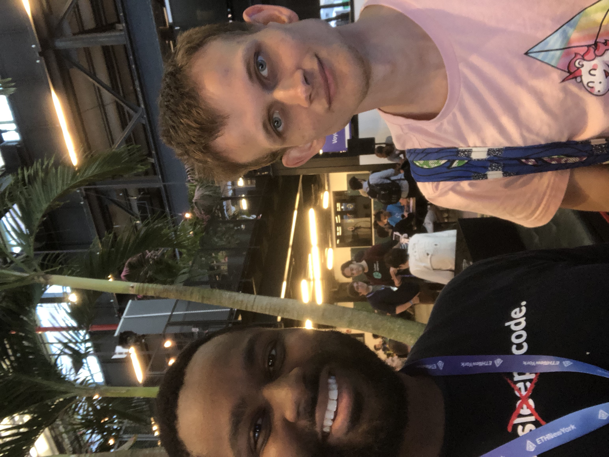

<h1 align="center">
Hello! My name is Tolani Oyefule.
</h1>
<h3 align="center" style="margin-bottom:10px">I'm a Software Engineer proficient in front-end and back-end web development. I transitioned from sales after working across a diverse list of industries including cybersecurity, instrumentation engineering and automation, telecommunications, and logistics. I recently earned a certificate in full stack web development at Montgomery College, with newly developed skills in JavaScript, CSS, SpringBoot, and MySQL. I'm passionate about working as a team and can work independently. When I'm not developing, I enjoy modifying cars, bodybuilding, learning guitar, cooking, and occasionally gaming.</h4>

  <h4>
    </a>
    
</h4>
 

 

## About Me

<ul>
<li> 🔭 I’m currently working on EMR Integration Software
<li> 🌱 I’m currently learning Python, Again
<li> 👯 I’m looking to collaborate with Anyone interested in Decentralized Finance / Crypto Currency OR EMR Applications
<li> 🤔 I’m looking for help with Epic and Cerner Implementation
<li> 💬 Ask me about Crypto Currency!!
<li> ⚡ Fun fact: I once Met the Founder of Ethereum
</ul>

 

## Technologies

<ul>
<li>Front-End: React, CSS, HTML, Bootstrap, Sass, Material-UI</li>
<li>Back-End: JavaScript, TypeScript, Python, Django, Node, Express, JSON, jQuery, Auth0, API</li>
<li>Database: MySQL, MongoDB, SQLite, PostgreSQL</li>
<li>Other: Heroku, Git, Bash, Webpack, AWS, Electron</li>
</ul>

